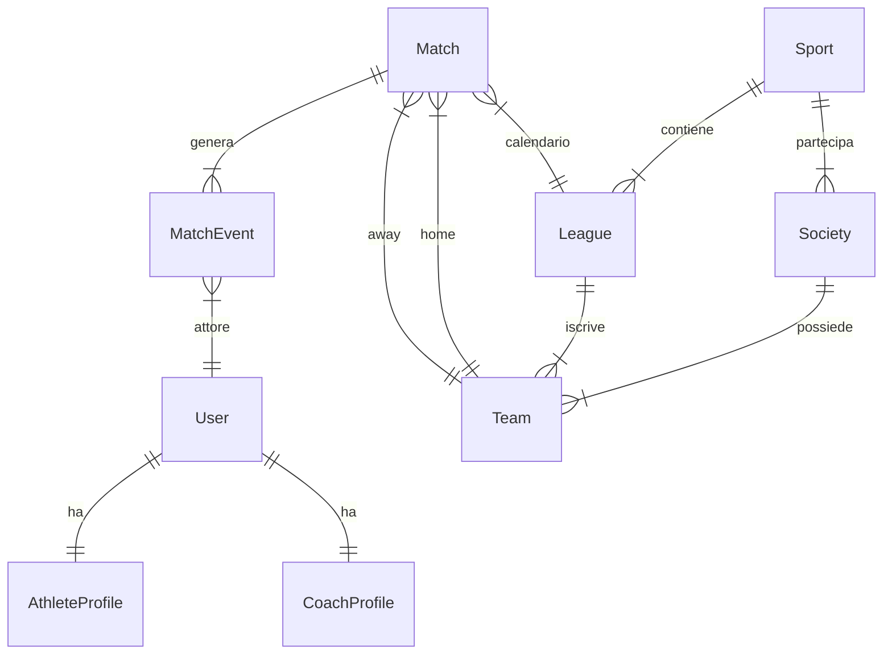

# MANUALE TECNICO - 2salti legacy

## 1. Panoramica del Progetto
**2salti legacy** è una piattaforma per la gestione di campionati sportivi e statistiche, sviluppata in **Python/Django**.
Il sistema è progettato per gestire ruoli utente complessi (Atleti, Allenatori, Arbitri, Presidenti), calendari partite, e statistiche generate automaticamente dai referti.

### Tech Stack
-   **Backend**: Django 5.x
-   **Database**: SQLite (Sviluppo) / PostgreSQL (Produzione - consigliato)
-   **Server**: Gunicorn + Nginx
-   **OS**: Linux (Ubuntu/Debian)

---

## 2. Struttura del Codice

Il progetto è suddiviso in "Apps" Django modulari:

### 📂 `core`
Gestisce le entità fondamentali che non cambiano spesso.
-   **Models**: `Sport`, `Society`, `Team`, `League`.
-   **Logica**: Definisce la gerarchia Società -> Squadre e l'organizzazione dei Campionati.

### 📂 `accounts`
Gestisce l'autenticazione e i profili utente estesi.
-   **User Model**: Custom User con campo `role`.
-   **Profiles**: `AthleteProfile`, `CoachProfile`, `RefereeProfile`, `PresidentProfile`.
-   **Automazione**: I profili vengono creati automaticamente via *Signals* alla registrazione.

### 📂 `matches`
Il cuore operativo della piattaforma.
-   **Models**: `Match` (Partita), `MatchEvent` (Gol, Espulsioni, Timeout).
-   **Logica**: Gestione del flusso partita, inserimento risultati.
-   **Servizi**: `stats_services.py` per calcolo automatico marcatori e disciplinare.

### 📂 `seasons`
Gestione dello storico.
-   **Models**: `SeasonArchive`.
-   **Logica**: Archiviazione delle statistiche a fine stagione per consultazione storica.

### 📂 `management` [NEW]
Funzionalità gestionali per società e squadre.
-   **Models**: `Membership`, `Training`, `Convocation`, `Post`, `ChatMessage`.
-   **Logica**: Gestione ruoli (RBAC), allenamenti (RSVP con Geofence), convocazioni e bacheca/chat di squadra.
-   **Permissions**: `permissions.py` per controlli di accesso basati sui ruoli di Membership.

---

## 3. Database Schema (Semplificato)



---

## 4. Installazione e Deployment

### Requisiti
-   Python 3.10+
-   Pip & Venv
-   Nginx (per produzione)

### Script di Automazione
Nella root del progetto sono presenti script per facilitare il deploy:

#### `deploy_django.sh`
Esegue la procedura completa di aggiornamento e riavvio:
1.  Installa dipendenze (`pip install gunicorn`).
2.  Raccoglie file statici (`collectstatic`).
3.  Configura Systemd (`formichina.service`).
4.  Configura Nginx e Redirect (`2salti_nginx_config`, `2salti_redirects_config`).
5.  Riavvia i servizi.

#### Infrastruttura Domini
Il sito principale è ora **2salti.com**. Tutti i vecchi domini (`formichina.com`, `duesalti.it`, ecc.) reindirizzano via Nginx a `https://2salti.com`.
- Configurazione Nginx: `/home/alberto/2salti_nginx_config`
- Configurazione Redirect: `/home/alberto/2salti_redirects_config`

#### `install_service.sh`
Script di utility per installare solo i file di servizio systemd e nginx (richiede password sudo hardcoded - **DA METTERE IN SICUREZZA**).

### Comandi Manuali
```bash
# Attivare virtual environment
source .venv/bin/activate

# Migrazioni Database
python manage.py makemigrations
python manage.py migrate

# Creare Superuser
python manage.py ensure_superuser

# Avvio Server Sviluppo
python manage.py runserver 0.0.0.0:8000
```
